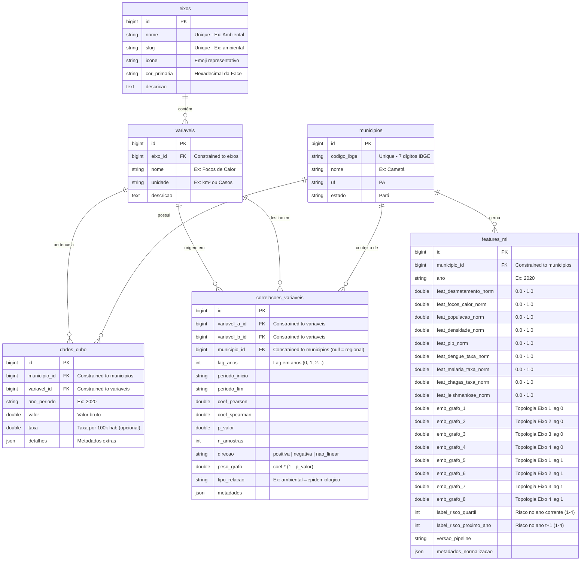

# Plataforma Trajetórias — Cubo de Dados Multidimensional & ML Pipeline
## Portal Científico INPE/Fiocruz (Região do Baixo Tocantins)

[](https://laravel.com)
[](https://livewire.laravel.com)
[](https://tailwindcss.com)
[](https://sqlite.org)

A **Plataforma Trajetórias** é um ecossistema científico de alto nível técnico e painel interativo de inteligência territorial de ponta. Fruto da parceria estratégica entre o **INPE** (Instituto Nacional de Pesquisas Espaciais) e a **Fiocruz** (Fundação Oswaldo Cruz), o sistema foi desenhado para modelar, cruzar e analisar o impacto de determinantes socioeconômicos, dinâmicas populacionais e alterações ambientais sobre o perfil epidemiológico na região do **Baixo Tocantins, Pará** (com foco analítico nos municípios de **Baião, Cametá e Mocajuba**).

A base estrutural da plataforma evoluiu de um clássico Cubo de Dados (ROLAP) para uma **Arquitetura Híbrida de 3 Camadas** com suporte nativo a **análise relacional de grafos** e um **pipeline pronto para Machine Learning (ML)**, viabilizando o treinamento futuro de redes neurais profundas (GNNs, LSTMs ou Random Forests) para classificação de trajetórias de risco no território.

---

## 🏛️ Arquitetura do Sistema: O Modelo de 3 Camadas

Para equilibrar alto desempenho em queries web reativas com flexibilidade para ciência de dados e machine learning, o sistema adota uma arquitetura em 3 camadas complementares:

```
┌─────────────────────────────────────────────────────────────┐
│                    CAMADA 1: FATOS (ROLAP)                   │
│  Star Schema tradicional (dados_cubo + eixos + variaveis +   │
│  municipios) — séries históricas brutas por ano/município.   │
│  → SQLite (desenvolvimento) / PostgreSQL (produção)          │
└─────────────────────────┬───────────────────────────────────┘
                          │ alimenta via Artisan Command
┌─────────────────────────▼───────────────────────────────────┐
│               CAMADA 2: CORRELAÇÕES (Graph Layer)            │
│  Grafo de arestas dinâmico: correlacoes_variaveis           │
│  (Pearson, Spearman, lag_anos, p_valor, direcao, peso)       │
│  → Representa a influência mútua entre variáveis como um     │
│    grafo estruturado relacionalmente (D3.js Ready)           │
└─────────────────────────┬───────────────────────────────────┘
                          │ alimenta via ML Pipeline
┌─────────────────────────▼───────────────────────────────────┐
│              CAMADA 3: ML PIPELINE (Feature Vectors)         │
│  Vetor de features por ano/município: features_ml           │
│  (métricas min-max normalizadas + embeddings de grafo       │
│   + classificação de risco epidemiológico por quartis)       │
│  → Exportável em JSON/CSV para PyTorch e TensorFlow          │
└─────────────────────────────────────────────────────────────┘
```

### Detalhamento das Camadas
1. **Camada 1 (ROLAP / Fatos):** Armazena os dados primários lidos das tabelas CSV das instituições parceiras (IBGE, PRODES/INPE, DATASUS). O modelo de dados está em **Star Schema** otimizado para agregações de séries históricas e renderização instantânea.
2. **Camada 2 (Graph Layer):** Em vez de exigir bancos de dados orientados a grafos pesados (como Neo4j), as arestas de correlação significativa ($p < 0.05$) são salvas na tabela `correlacoes_variaveis`. Essa tabela funciona como uma matriz de adjacência esparsa, permitindo consultas de grafos submilissegundos usando SQL puro.
3. **Camada 3 (ML Pipeline):** Consolida e normaliza as variáveis em vetores numéricos de 9 features, agregando um embedding topológico bidirecional obtido a partir das arestas da Camada 2. Ela calcula a classificação de risco epidemiológico (alvo) do ano corrente e do ano subsequente (target de treino).

---

## 🔬 Metodologia Científica e Fórmulas Matemáticas

As relações entre eixos não são arbitrárias; elas são calculadas programaticamente usando rigor estatístico. Abaixo estão as metodologias matemáticas implementadas nos comandos do sistema.

### 1. Coeficiente de Correlação de Pearson ($r$)
Utilizado para medir a força e a direção da associação linear entre duas séries numéricas contínuas alinhadas no tempo:

$$r = \frac{\sum_{i=1}^{n} (x_i - \bar{x})(y_i - \bar{y})}{\sqrt{\sum_{i=1}^{n} (x_i - \bar{x})^2 \sum_{i=1}^{n} (y_i - \bar{y})^2}}$$

Onde $\bar{x}$ e $\bar{y}$ são as médias das séries $X$ e $Y$, respectivamente. O valor varia entre $-1$ (correlação negativa perfeita) e $+1$ (correlação positiva perfeita).

### 2. Coeficiente de Correlação de Postos de Spearman ($\rho$)
Para relações não lineares ou variáveis com distribuições não normais (muito comuns em dados ambientais e epidemiológicos), o sistema converte os dados em postos ordenados (ranks) e aplica a fórmula de correlação.
No caso de empates nos dados brutos, o algoritmo atribui a **média aritmética dos postos** correspondentes, prevenindo distorções matemáticas.

### 3. Alinhamento com Defasagem Temporal (Temporal Lag)
Variáveis ambientais (como queimadas ou desmatamento) e socioeconômicas frequentemente produzem efeitos na saúde (como proliferação de dengue ou malária) após uma defasagem temporal de alguns anos.
O algoritmo do sistema implementa o alinhamento com lag $L$ (em anos), pareando o vetor $X$ no ano $t$ com o vetor $Y$ no ano $t + L$:

$$X_{lag} = [x_t, x_{t+1}, \dots, x_{T-L}]$$
$$Y_{lag} = [y_{t+L}, y_{t+L+1}, \dots, y_{T}]$$

Isso permite identificar se "o incremento do desflorestamento em $t$ se co-relaciona fortemente com o aumento de malária em $t+2$".

### 4. Significância Estatística ($p$-valor) via t de Student
Para evitar falsas correlações decorrentes de séries temporais curtas, cada par passa por um teste de hipótese bicaudal. O sistema calcula a estatística $t$:

$$t = r \sqrt{\frac{n - 2}{1 - r^2}}$$

Onde $n$ é o número de amostras alinhadas e $df = n - 2$ são os graus de liberdade. O $p$-valor correspondente à distribuição t de Student é obtido computando a **Função Beta Incompleta Regularizada** $I_x(a, b)$:

$$p\text{-valor} = I_{\frac{df}{df + t^2}}\left(\frac{df}{2}, 0.5\right)$$

#### Integração Numérica e Expansão de Lentz
Para calcular $I_x(a, b)$ no PHP sem dependências externas, o sistema implementa a expansão em fração contínua de Lentz:

$$I_x(a, b) = \frac{x^a (1-x)^b}{a \cdot \text{Beta}(a, b)} \left[ \frac{1}{1 + \frac{d_1}{1 + \frac{d_2}{1 + \dots}}} \right]$$

Onde o logaritmo natural da função Gamma ($\ln\Gamma(z)$) (usado para calcular a função Beta no denominador) é aproximado com alta precisão (erro $< 5 \times 10^{-11}$ para $z > 0$) usando a **Série de Lanczos** com $g=7$ e $n=9$ termos. Correlações com $p\text{-valor} > 0.05$ (limiar de rejeição da hipótese nula) são descartadas pelo pipeline de dados para economizar espaço e evitar ruído no grafo.

### 5. Agrupamento de Dados (Data Pooling) para Correlações Regionais
Como cada município possui uma série temporal anual de tamanho limitado (ex: 18 anos), calcular correlações locais para lags altos diminui drasticamente o número de amostras disponíveis ($n$).
Para calcular coeficientes regionais (onde `municipio_id` = `null`), o sistema executa o **data pooling** espacial: ele concatena as observações de todos os municípios em um único vetor estatístico alinhado espacialmente.
Isso multiplica o tamanho amostral pelo número de municípios, mantendo a consistência metodológica e garantindo graus de liberdade suficientes para o teste $t$ ser cientificamente representativo.

### 6. Normalização Min-Max Global
Antes de alimentar o ML Pipeline, as variáveis brutas contidas no cubo (com grandezas muito distintas: PIB em Reais, população em habitantes, desmatamento em $\text{km}^2$ e taxa epidemiológica por $100$ mil hab.) são re-escaladas para o intervalo uniforme $[0, 1]$ com base nos mínimos e máximos calculados globalmente em toda a base histórica:

$$x_{norm} = \frac{x - \min(X)}{\max(X) - \min(X)}$$

### 7. Classificação em Quartis de Risco Epidemiológico
Para servir de rótulo supervisionado, o sistema calcula um **Score Epidemiológico Composto** baseado em uma média ponderada das variáveis epidemiológicas normalizadas:

$$\text{Score} = 0.35 \cdot \text{Dengue}_{norm} + 0.35 \cdot \text{Malaria}_{norm} + 0.15 \cdot \text{Chagas}_{norm} + 0.15 \cdot \text{Leishmaniose}_{norm}$$

O score é convertido em 4 classes discretas baseadas nos quartis globais de distribuição de toda a série do território:
*   **Classe 1 — Baixo Risco:** $\text{Score} \le Q_1$
*   **Classe 2 — Risco Moderado:** $Q_1 < \text{Score} \le Q_2$
*   **Classe 3 — Risco Alto:** $Q_2 < \text{Score} \le Q_3$
*   **Classe 4 — Risco Crítico:** $\text{Score} > Q_3$

O pipeline calcula tanto a classe do ano corrente (`label_risco_quartil`) quanto a classe do ano seguinte (`label_risco_proximo_ano`), fornecendo ao modelo preditivo o target preditivo ideal de séries temporais.

### 8. Embeddings Topológicos de Grafo
Para que classificadores tradicionais capturem a topologia de influência de variáveis do município, cada registro de `features_ml` é enriquecido com um **Embedding do Grafo** de 8 dimensões:
*   **Dimensões 1 a 4 (Sem lag):** Representam a força média (peso das arestas significativas $p<0.05$) das conexões no ano corrente envolvendo indicadores de cada um dos 4 eixos (Ambiental, Social, Econômico, Epidemiológico).
*   **Dimensões 5 a 8 (Com lag = 1):** Representam a força média de conexões temporais defasadas em 1 ano envolvendo indicadores de cada eixo.

Isso fornece um vetor de contexto dinâmico representando a "estrutura relacional" daquele município para o classificador.

---

## 🗺️ Modelagem do Banco de Dados (ERD)

O banco de dados do projeto (implementado nativamente em SQLite para portabilidade) adota o esquema físico abaixo, estendendo o Star Schema básico com as tabelas de Grafo e ML:



---

## 📂 Estrutura de Diretórios do Projeto

Abaixo é exibida a organização estrutural do projeto Laravel, com destaque para a arquitetura de cálculo estatístico de correlações e geração de features:

```
├── app/
│   ├── Console/
│   │   └── Commands/
│   │       ├── CalcularCorrelacoes.php  # [NOVO] Algoritmo estatístico de Pearson, Spearman & Lag temporal
│   │       └── GerarFeaturesMl.php      # [NOVO] Pipeline de normalização, quartis e embeddings do grafo
│   ├── Http/
│   │   └── Controllers/
│   │       └── Api/
│   │           └── GrafoCorrelacaoController.php # [NOVO] API REST de Nós/Arestas do Grafo e exportação de Tensors
│   ├── Livewire/
│   │   ├── HipercuboDashboard.php      # Controller central reativo (Livewire) do Cubo 3D, Heatmaps e D3.js
│   │   └── DataCubeDashboard.php       # Painel alternativo de listagem clássica de dados
│   ├── Models/
│   │   ├── Municipio.php               # Representação geográfica dos municípios estudados
│   │   ├── Eixo.php                    # As 4 dimensões (Ambiental, Social, Econômico, Epidemiológico)
│   │   ├── Variavel.php                # Os indicadores analíticos de cada eixo
│   │   ├── DadoCubo.php                # Fato centralizada (valores, taxas por 100k hab, etc.)
│   │   ├── CorrelacaoVariavel.php      # [NOVO] Model de arestas do grafo e scopes de significância
│   │   └── FeatureMl.php               # [NOVO] Model de vetores de features normalizados e embeddings
│   └── Services/
│       └── DashboardStatistics.php     # Serviços de estatísticas e cache reativo
│
├── database/
│   ├── migrations/
│   │   ├── 2026_06_01_000001_create_municipios_table.php
│   │   ├── 2026_06_01_000002_create_eixos_table.php
│   │   ├── 2026_06_01_000003_create_variaveis_table.php
│   │   ├── 2026_06_01_000004_create_dados_cubo_table.php
│   │   ├── 2026_06_22_000005_create_correlacoes_variaveis_table.php # [NOVO] Tabela do Graph Layer
│   │   └── 2026_06_22_000006_create_features_ml_table.php             # [NOVO] Tabela de Features de ML
│   └── seeders/
│       ├── DatabaseSeeder.php
│       └── DataCubeSeeder.php          # Importador de CSVs e populador do Star Schema
│
├── public/
│   └── tables/                         # Arquivos CSV contendo as séries originais INPE/IBGE/Fiocruz
│
├── resources/
│   ├── css/
│   │   └── app.css                     # Estilos do painel, Tailwind CSS e motor 3D CSS
│   ├── views/
│   │   ├── livewire/
│   │   │   ├── hipercubo-dashboard.blade.php  # Dashboard reativo principal (HTML/CSS3/ChartJS/Leaflet/D3)
│   │   │   └── data-cube-dashboard.blade.php
│   │   └── welcome.blade.php           # Landing Page premium e portal de entrada da plataforma
│   └── js/
│       └── app.js                      # Scripts e inicializadores client-side
│
├── routes/
│   ├── api.php                         # [NOVO] Definição de rotas REST v1 para consumo
│   └── web.php                         # Rotas HTTP principais
│
└── tests/
    └── Feature/
        ├── HipercuboDashboardTest.php  # Testes de integração do Livewire e cubos de dados
        └── ExampleTest.php
```

---

## 🚀 Instalação e Execução

### Pré-requisitos
*   **PHP >= 8.1** com as extensões `pdo_sqlite`, `mbstring`, `xml` e `json` ativas.
*   **Composer** (Gerenciador de Dependências PHP).
*   **Node.js >= 18** e **npm**.

### Passo 1: Configurar Ambiente
Clone o repositório e crie o arquivo de ambiente `.env`:
```bash
git clone https://github.com/murilohenderson/Cubo-de-Dados-Projeto-Trajetorias.git
cd Cubo-de-Dados-Projeto-Trajetorias
cp .env.example .env
```

Garanta que o `.env` está configurado para utilizar banco de dados **SQLite** (recomendado para desenvolvimento local rápido):
```dotenv
DB_CONNECTION=sqlite
# O Laravel criará automaticamente o banco de dados em database/database.sqlite
```

### Passo 2: Instalar Dependências e Compilar
Instale os pacotes e compile os pacotes de front-end:
```bash
composer install
npm install
php artisan key:generate
```

### Passo 3: Migrar e Popular Banco de Dados
Este comando criará toda a estrutura de tabelas do Star Schema e processará a carga de todos os arquivos CSV contendo os dados reais das instituições parceiras:
```bash
php artisan migrate:fresh --seed
```

### Passo 4: Executar os Processamentos Científicos (Metodologia)
Uma vez que o banco de dados contém os dados originais (Camada 1), você deve rodar os comandos Artisan para calcular o Grafo de Correlações (Camada 2) e em seguida gerar os vetores normalizados e embeddings para Machine Learning (Camada 3):

```bash
# 1. Calcula o Grafo de correlações (p-valor máximo 0.05 e lag de até 2 anos)
php artisan calcular:correlacoes --lag-max=2 --p-max=0.05 --force

# 2. Gera os vetores de features normalizados e embeddings topológicos, exportando também para CSV
php artisan gerar:features-ml --versao=1.0 --export-csv
```

> [!NOTE]
> O arquivo CSV gerado pelo pipeline de exportação será salvo em `storage/app/features_ml.csv` e estará pronto para importação via Pandas (`pd.read_csv()`) em seu ambiente Python (Jupyter Notebook / PyTorch).

### Passo 5: Executar Servidores de Desenvolvimento
Inicie o servidor local do Laravel e o compilador de assets Vite em terminais separados:
```bash
# Terminal 1: Servidor Laravel
php artisan serve

# Terminal 2: Compilador Vite
npm run dev
```
Acesse a aplicação no navegador em **[http://localhost:8000](http://localhost:8000)**.

---

## 📡 Documentação da API REST (v1)

A plataforma disponibiliza endpoints públicos para que pesquisadores possam consumir diretamente o grafo de correlações e os dados estruturados de features para ML. Todas as rotas possuem o prefixo `/api/v1`.

### 1. Camada de Grafo (Graph Layer)

#### `GET /api/v1/grafo`
Retorna a lista de nós (variáveis) e arestas (correlações estatisticamente válidas) no formato de lista de adjacência, adequado para bibliotecas de grafos (NetworkX, D3.js).
*   **Parâmetros de Query:**
    *   `municipio_id`: Filtra correlações daquele município (se omitido, traz a correlação regional pooling).
    *   `lag`: Filtra por lag temporal específico (ex: `?lag=1`). Traz todos os lags por padrão.
    *   `p_max`: Limiar de significância estatística máxima (padrão: `0.05`).
*   **Exemplo de Resposta:**
    ```json
    {
      "nos": [
        {"id": 1, "name": "Desmatamento", "eixo": "ambiental"},
        {"id": 2, "name": "Dengue", "eixo": "epidemiologico"}
      ],
      "arestas": [
        {
          "source": 1,
          "target": 2,
          "weight": 0.949,
          "lag": 2,
          "p_value": 0.0001,
          "pearson": 0.95,
          "spearman": 0.93,
          "direcao": "positiva",
          "tipo_relacao": "ambiental→epidemiologico",
          "municipio_id": 1
        }
      ],
      "meta": {
        "total_nos": 2,
        "total_arestas": 1,
        "p_max": 0.05,
        "lag_filtro": null
      }
    }
    ```

#### `GET /api/v1/grafo/{municipio_id}`
Retorna o grafo específico de correlações obtido de forma dedicada para um determinado município.

#### `GET /api/v1/grafo/cruzamento/{tipo}`
Retorna correlações ocorridas em um cruzamento específico de eixos.
*   **Tipos válidos:** `ambiental-social`, `ambiental-economica`, `social-economica`, `ambiental-epidemiologica`, `social-epidemiologica`, `economica-epidemiologica`.

---

### 2. Pipeline de ML (ML Pipeline)

#### `GET /api/v1/features-ml/schema`
Traz o dicionário de dados (metadata) e a ordem exata de injeção dos tensores para garantir que o treinamento do modelo Python leia os dados sem desalinhamento de features.

#### `GET /api/v1/features-ml/export`
Exporta o dataset completo com todos os municípios e anos históricos em JSON pronto para carregamento e treinamento offline.
*   **Exemplo de Resposta:**
    ```json
    [
      {
        "municipio_id": 1,
        "municipio_nome": "Cametá",
        "ano": "2015",
        "features": [0.12, 0.05, 0.45, 0.22, 0.60, 0.15, 0.08, 0.01, 0.10],
        "graph_embedding": [0.85, 0.23, 0.45, 0.10, 0.0, 0.0, 0.0, 0.0],
        "label": 2,
        "label_target": 3
      }
    ]
    ```

#### `GET /api/v1/features-ml/{municipio_id}`
Retorna a série histórica de vetores de features e labels específicos para um município ao longo de todo o tempo.

---

## 🎨 O Painel Visual: Funcionalidades do Frontend

O dashboard principal reativo do sistema (desenvolvido com **Laravel Livewire 3** e **Alpine.js**) contém os seguintes módulos visuais de ponta:

1.  **Hipercubo 3D Interativo:** Renderização 3D de um cubo CSS. É possível arrastar e rotacionar espacialmente o cubo. Clicar em uma face foca a visualização nas variáveis daquela combinação de eixos.
2.  **Matrizes de Risco & Calor (Heatmaps):** Exibe o nível de risco calculado por município para cada variável selecionada. Adota um degradê cromático baseado nos quartis de severidade estatística.
3.  **Grafo de Relações (D3.js Force Graph):** Renderiza dinamicamente na tela o grafo de correlações da tabela `correlacoes_variaveis`. As arestas são coloridas de acordo com o sentido (azul para positiva, vermelho para negativa) e a largura da linha representa a força da correlação. É possível filtrar por lag temporal ou município em tempo real.
4.  **ML Predictor & Vector Inspect:** Uma tela científica voltada à visualização do vetor de características daquele município. Ela exibe o radar das features normalizadas, as dimensões ativas de embedding do grafo e o quartil de risco predito comparado ao ano seguinte.
5.  **Mapeamento Coroplético (Leaflet JS):** Mapeamento geográfico interativo integrado com os limites cartográficos municipais da região de Baião, Cametá e Mocajuba, exibindo o risco territorial em cores.
6.  **Painel Drill-Down de Evidências (Chart.js):** Clicar em qualquer célula do heatmap ou nó do grafo abre um modal contendo os gráficos históricos de linhas e regressões, contendo dados completos.

---

## 🧪 Suíte de Testes Automatizados

Para garantir a confiabilidade dos algoritmos matemáticos e a integridade da plataforma, o projeto possui testes automatizados unitários e de integração configurados sob o PHPUnit.

### Execução dos Testes:
```bash
php artisan test
```

> [!IMPORTANT]
> **Isolamento de Base de Teste:**
> A suíte de testes está configurada em `phpunit.xml` para injetar variáveis de ambiente que forçam o banco de dados a rodar em memória SQLite (`:memory:`):
> ```xml
> <env name="DB_CONNECTION" value="sqlite"/>
> <env name="DB_DATABASE" value=":memory:"/>
> ```
> Isso garante que rodar `php artisan test` execute todos os rollbacks e refreshes de migração sem afetar os dados reais semeados na sua base local (`database/database.sqlite`), mantendo o isolamento absoluto dos testes de desenvolvimento.

---

## 🤝 Parceria Científica e Fomento

Este projeto faz parte de uma iniciativa de pesquisa avançada em saúde pública e ciências espaciais brasileiras:
*   **INPE (Instituto Nacional de Pesquisas Espaciais):** Fornecimento de dados orbitais de desflorestamento e focos de calor na Amazônia Legal (PRODES, DETER).
*   **Fiocruz (Fundação Oswaldo Cruz):** Consolidação histórica de indicadores epidemiológicos de doenças de veiculação vetorial e monitoramento de vulnerabilidade social de populações ribeirinhas do Baixo Tocantins.
*   **UFPA (Universidade Federal do Pará):** Apoio acadêmico e institucional de campo no Baixo Tocantins.
