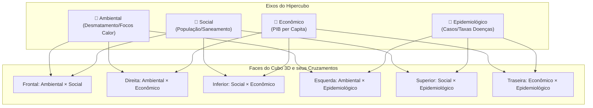
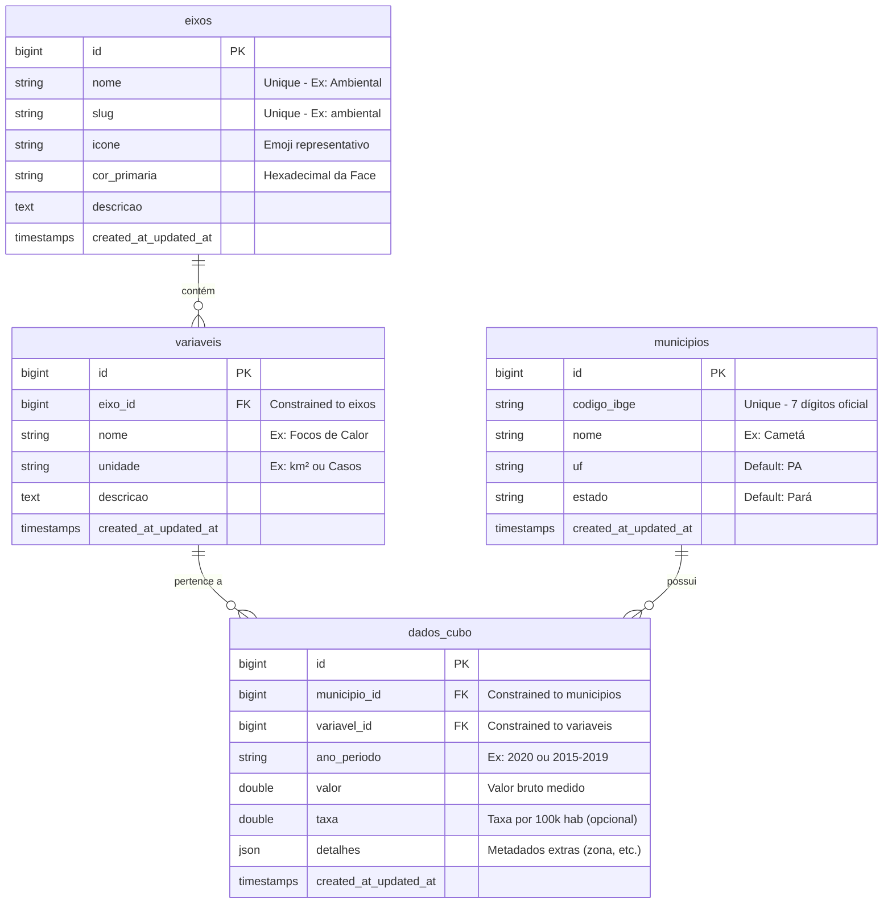

# Plataforma Trajetórias — Cubo de Dados Multidimensional
## Portal Científico INPE/Fiocruz (Região do Baixo Tocantins)

[](https://laravel.com)
[](https://livewire.laravel.com)
[](https://tailwindcss.com)
[](https://sqlite.org)

A **Plataforma Trajetórias** é um ecossistema científico e painel interativo de inteligência territorial de ponta. Fruto da parceria estratégica entre o **INPE** (Instituto Nacional de Pesquisas Espaciais) e a **Fiocruz** (Fundação Oswaldo Cruz), o sistema foi desenvolvido para modelar, cruzar e analisar o impacto de determinantes socioeconômicos, dinâmicas populacionais e alterações ambientais sobre o perfil epidemiológico na região do **Baixo Tocantins, Pará** (com foco analítico central nos municípios de **Baião, Cametá e Mocajuba**).

O coração tecnológico da plataforma consiste em um **Cubo de Dados Multidimensional (Hipercubo)** que correlaciona de forma dinâmica dados de séries históricas de desmatamento, pecuária, focos de calor, população, PIB e a incidência de doenças endêmicas tropicais como Dengue, Doença de Chagas, Leishmanioses e Malária.

---

## Características Inovadoras e Funcionalidades

1. **Hipercubo 3D Interativo:** 
   - Rotação espacial tridimensional do cubo por meio de uma interface CSS3 elegante.
   - Cada face representa o cruzamento exato e exclusivo de 2 eixos temáticos (6 faces únicas sem redundância).
2. **Matrizes Dinâmicas de Correlação & Calor (Heatmaps):**
   - Cruzamento automatizado de variáveis e municípios com gradientes visuais baseados em quartis de risco.
   - Respostas instantâneas e reativas via **Laravel Livewire** sem a necessidade de recarregar a página.
3. **Modo Comparativo de Alta Performance (Split Screen):**
   - Permite duplicar o painel visual e comparar diferentes faces do cubo (ex.: Efeito Ambiental vs. Efeito Econômico) de forma síncrona.
4. **Algoritmo Científico de Risco Baseado em Quartis:**
   - Classificação municipal inteligente (Nível de Risco 1 a 4) calculada dinamicamente com base nas taxas de incidência locais.
5. **Painel de Evidências e Análise Drill-down:**
   - Seleção de células para abertura de modais com detalhamento científico profundo.
   - Gráficos de linhas e barras interativos integrados com **Chart.js**, exibindo séries históricas completas e tendências.
6. **Mapeamento Coroplético Georreferenciado:**
   - Integração nativa com **Leaflet JS** para exibir indicadores espacializados nos polígonos dos municípios mapeados.
7. **Pipeline de Carga de Dados Robusto:**
   - Mecanismo automatizado de parse e tratamento de dados de planilhas CSV reais do INPE, IBGE e SUS/Fiocruz, incluindo a resolução inteligente de divergências de dígitos de controle do IBGE.

---

## Arquitetura do Cubo de Dados (Eixos & Faces)

O sistema organiza a informação em **4 Eixos Principais (Dimensões)**. A combinação desses eixos gera **6 faces exclusivas no Cubo 3D**, descritas no fluxo abaixo:



### Detalhamento das 6 Faces Únicas
- **`front` (Ambiental × Social):** Analisa como desmatamento e queimadas, somados à densidade populacional, influenciam a degradação do habitat.
- **`right` (Ambiental × Econômica):** Correlaciona atividades produtivas agropastoris e degradação florestal com o crescimento econômico regional.
- **`bottom` (Social × Econômica):** Cruza indicadores de renda (PIB per Capita) com infraestrutura urbana e vulnerabilidade populacional.
- **`left` (Ambiental × Epidemiológica):** Evidencia a relação direta entre desflorestamento/queimadas e a proliferação de vetores de zoonoses tropicais.
- **`top` (Social × Epidemiológica):** Avalia o impacto das condições de moradia e saneamento básico nas taxas de incidência de infecções.
- **`back` (Econômica × Epidemiológica):** Analisa a relação entre o desenvolvimento econômico local e o investimento/incidência de endemias no território.

---

## Modelagem do Banco de Dados (ERD)

A base de dados foi desenhada sob uma arquitetura de **Esquema Estrela (Star Schema)** otimizada para Data Warehouses rápidos. A tabela fato centralizada (`dados_cubo`) armazena os indicadores consolidados e faz referências rápidas às dimensões do sistema (`municipios`, `variaveis`, `eixos`).



> [!NOTE]
> Foram adicionados **índices de banco de dados compostos** nas colunas `['variavel_id', 'municipio_id']` e `['variavel_id', 'ano_periodo']` da tabela `dados_cubo` para garantir tempos de consulta submilissegundos durante as agregações de séries históricas e renderização do heatmap.
---

## Estrutura de Diretórios do Projeto

Aqui está a organização estrutural do projeto, focando nos componentes fundamentais da plataforma:

```
├── app/
│   ├── Livewire/
│   │   ├── HipercuboDashboard.php      # Controller central reativo (Livewire) do Cubo 3D e Matrizes
│   │   └── DataCubeDashboard.php       # Painel alternativo de listagem clássica de dados
│   ├── Models/
│   │   ├── Municipio.php               # Representação dos municípios (Baião, Cametá, Mocajuba)
│   │   ├── Eixo.php                    # As 4 dimensões (Ambiental, Social, Econômico, Epidemiológico)
│   │   ├── Variavel.php                # Os indicadores/métricas de cada eixo
│   │   └── DadoCubo.php                # Fatos centrais (dados do cubo, valores, taxas, filtros JSON)
│   └── Services/
│       └── DashboardStatistics.php     # Serviços auxiliares de estatísticas com cache inteligente
│
├── database/
│   ├── migrations/
│   │   ├── 2026_06_01_000001_create_municipios_table.php
│   │   ├── 2026_06_01_000002_create_eixos_table.php
│   │   ├── 2026_06_01_000003_create_variaveis_table.php
│   │   └── 2026_06_01_000004_create_dados_cubo_table.php
│   └── seeders/
│       ├── DatabaseSeeder.php          # Chamador dos seeders
│       └── DataCubeSeeder.php          # Importador e normalizador de CSVs reais
│
├── public/
│   └── tables/                         # Base de dados em CSV (Ambiental, Social, Econômico, Epidemiológico)
│
├── resources/
│   ├── css/
│   │   └── app.css                     # Configurações do Tailwind CSS e estilos personalizados do Cubo 3D
│   ├── views/
│   │   ├── livewire/
│   │   │   ├── hipercubo-dashboard.blade.php  # Interface gráfica rica e interativa do dashboard
│   │   │   └── data-cube-dashboard.blade.php   # Layout Blade para visualização complementar
│   │   └── welcome.blade.php           # Estrutura HTML5 da página inicial, Leaflet CSS e ChartJS
│   └── js/
│       └── app.js                      # Inicializador de scripts client-side
│
├── tests/
│   └── Feature/
│       └── HipercuboDashboardTest.php  # Suíte completa de testes de integração e comportamento do Livewire
```

---

## Requisitos de Instalação

Antes de iniciar, certifique-se de possuir em sua máquina local:
- **PHP >= 8.1** com extensões `pdo_sqlite`, `mbstring`, `xml` e `json` ativas.
- **Composer** (gerenciador de dependências PHP).
- **Node.js >= 18** e **npm** (para empacotamento de assets front-end via Vite).

---

## Instalação e Execução

### Passo 1: Clonar o Repositório
```bash
git clone https://github.com/murilohenderson/Cubo-de-Dados-Projeto-Trajetorias.git
cd Cubo-de-Dados-Projeto-Trajetorias
```

### Passo 2: Configurar o Arquivo de Ambiente
Copie o modelo de ambiente:
```bash
cp .env.example .env
```

Garanta que o `.env` está configurado para utilizar banco de dados **SQLite** (recomendado para desenvolvimento local rápido):
```dotenv
DB_CONNECTION=sqlite
# O Laravel criará automaticamente o banco de dados em database/database.sqlite
```

### Passo 3: Instalar as Dependências do PHP
```bash
composer install
```

### Passo 4: Instalar as Dependências de Front-end e Compilar
```bash
npm install
```

### Passo 5: Gerar a Chave da Aplicação Laravel
```bash
php artisan key:generate
```

### Passo 6: Executar as Migrations e Alimentar o Banco de Dados (Seed)
Este comando criará toda a estrutura de tabelas relacionais do Hipercubo e processará a carga de todos os arquivos CSV contendo os dados reais das instituições parceiras:
```bash
php artisan migrate:fresh --seed
```

### Passo 7: Iniciar o Servidor de Desenvolvimento
Em terminais separados, execute o servidor de desenvolvimento do Laravel e o compilador Vite:

```bash
# Terminal 1: Servidor Laravel
php artisan serve
```

```bash
# Terminal 2: Compilação de Assets (Vite)
npm run dev
```

Abra o navegador e acesse **[http://localhost:8000](http://localhost:8000)**.

---

## Suíte de Testes Automatizados

A plataforma conta com testes de integração unitários e de comportamento focados no componente reativo `HipercuboDashboard`. Os testes cobrem:
- Renderização correta da página inicial e injeção do componente Livewire.
- Funcionamento dinâmico do controle de rotação e seleção de faces em 3D.
- Validação do fluxo de disparo de eventos Javascript (para atualização em tempo real de gráficos Chart.js e polígonos Leaflet).
- Garantia de que cada uma das 6 faces possui combinações exclusivas de dimensões.

### Executar a Suíte de Testes:
```bash
php artisan test
```

> [!IMPORTANT]
> **Garantia de Isolamento dos Testes:**
> A suíte de testes está configurada em `phpunit.xml` para utilizar um banco de dados SQLite em memória (`:memory:`):
> ```xml
> <env name="DB_CONNECTION" value="sqlite"/>
> <env name="DB_DATABASE" value=":memory:"/>
> ```
> Isso garante que a execução do comando `php artisan test` (que faz o rollback e re-fresh do banco usando a trait `RefreshDatabase`) seja executada de forma **100% isolada**, sem apagar ou afetar os dados semeados na sua base de desenvolvimento local (`database/database.sqlite`).

---

## Parceria Científica e Fomento

Este projeto faz parte de uma iniciativa de pesquisa avançada em saúde pública e ciências espaciais:

* **INPE (Instituto Nacional de Pesquisas Espaciais):** Fornecimento de dados orbitais de alta resolução (PRODES, DETER) para monitoramento do incremento do desmatamento e focos de calor na Amazônia Legal.
* **Fiocruz (Fundação Oswaldo Cruz):** Consolidação histórica de indicadores epidemiológicos de doenças de veiculação vetorial e monitoramento de vulnerabilidade em populações tradicionais ribeirinhas e indígenas da Amazônia.
* **UFPA (Universidade Federal do Pará):** Apoio institucional de campo na região do Baixo Tocantins.
